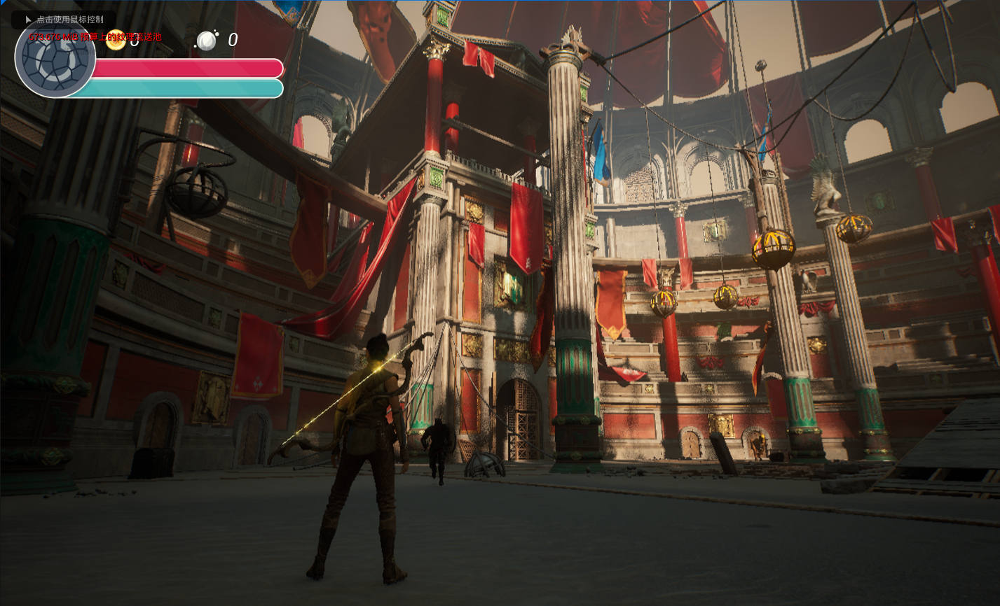

# UE5_Action_Slash

The game seamlessly blends grand fantasy storytelling, eerie atmospheres, and demanding combat, immersing players in a mysterious and perilous fantasy realm. In the world of Slash, players confront a variety of magical creatures, colossal bosses, and intricate subterranean landscapes. The narrative is profound, requiring players to unravel the deeper story through puzzle-solving, exploration, and combat. The world is teeming with conspiracy and mystery, with every corner harboring deadly threats and valuable rewards.

The game is developed entirely in C++, without the use of any third-party plugins.

# Demo
[Demo](https://www.youtube.com/watch?v=2m4XY6OuuPE)

(If gifs are not shown please wait or go to [Gifs](Demo/Gifs) to watch them.)
# Features
## Combat System
  
Combat System: The combat system encompasses box collision detection, box tracing, motion warping, combo systems, hit response, health and stamina calculations, loot generation, and death handling. Using C++ class inheritance and virtual functions to implement weapons with different mechanics.

## Shooting System
  
Shooting System: The shooting system includes multi-directional aiming animations and turning animations implemented using aim offset, bow and arrow weapon mechanics, arrow generation and hit detection, line tracing from the screen center, additive animation for shooting while moving, hit effects, and more.

## Parkour System
  
Parkour System: The parkour system utilizes multi-directional sphere and line tracing to calculate the starting and ending positions of actions. Motion warping is employed to project the character to the correct locations, enabling seamless traversal of obstacles.

## Enemy Partol
  
Enemy Patrol: AI controllers are configured for system-controlled enemies, enabling them to patrol between designated patrol points. Timers are set to establish intervals for scheduled patrols. Additionally, the PawnSeen system is leveraged to define the enemy's field of vision.

## Different Enemy Behavior
  
Diverse Enemy Behaviors: Utilizing C++ class inheritance, distinct behaviors and attributes for different enemies have been implemented. Each enemy has unique numerical characteristics, varied attack animations, and different aggression levels. Future plans involve employing behavior tree design to create even more intricate and diverse enemy behaviors.

# Features to come
### Riding system
### More weapons
### Bosses
### More parkour actions
### Dynamic maps with traps and rewards
### More ability
### Fancy effects

# Thank you!
